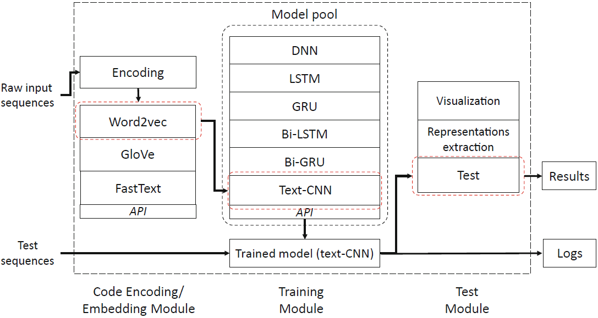

# Cyber Code Intelligence

This repository provides papers, code and tools that a beginner needs to start exploring the field of Cyber Code Intelligence (CyberCI).

# Content
  * [Introduction](#introduction)
  * [Technical Papers](#technical-papers)
  * [Surveys](#surveys)
  * [Tools](#tools)
  * [Data](#data: souruce code & binary code)
  * [Contact](#contact)

## Introduction

The CyberCI is data-driven code analysis using pattern recognition and machine learning (ML), which provides alternative solutions for automated, potentially more intelligent and efficient code analysis and processing. Particularly, The booming of the open source software community has made vast amounts of software code available, which allows machine learning and data mining techniques to exploit abundant patterns within software code. This repository lists the technical papers, developed tools and surveys of the CyberCI Research from the NSCLab, Swinburne University of Technology, Australia, for newbies who are interested in applying the state-of-the-art ML techniques for code analysis and processing.

<table width="100%" border="0" cellspacing="0" cellpadding="0">
  <tr>
    <td align="center"> </td>
  </tr>
  <tr>
    <td align="center">Fig. 1: The Cyber Code Intelligence (CyberCI)</td>
  </tr>
</table>

## Technical Papers

 * POSTER:Vulnerability discovery with function representation learning from unlabeled projects (CCS-2017)   
 [[Paper]](https://dl.acm.org/doi/abs/10.1145/3133956.3138840) [[Python Code]](https://github.com/DanielLin1986/function_representation_learning)
 * Cross-project transfer representation learning for vulnerable function discovery (TII-2018)   
 [[Paper]](https://ieeexplore.ieee.org/abstract/document/8329207) [[Python Code]](https://github.com/DanielLin1986/TransferRepresentationLearning)
 * Deep Learning-Based Vulnerable Function Detection-A Benchmark (ICICS-2019)   
 [[Paper]](https://link.springer.com/chapter/10.1007/978-3-030-41579-2_13) [[Python Code]](https://github.com/DanielLin1986/Function-level-Vulnerability-Detection)
 * Cyber Vulnerability Intelligence for Internet of Things Binary (TII-2019)     
 [[Paper]](https://ieeexplore.ieee.org/abstract/document/8892533) [[Python Code]](https://github.com/wolong3385/BiVulD) [[Video]](https://www.youtube.com/watch?v=eoOFrz8e0DE)
 * Software Vulnerability Discovery via Learning Multi-domain Knowledge Bases (TDSC-2020)   
 [[Paper]](https://ieeexplore.ieee.org/abstract/document/8906156) [[Python Code]](https://github.com/DanielLin1986/RepresentationsLearningFromMulti_domain)
 * DeepBalance- Deep-Learning and Fuzzy Oversampling for Vulnerability Detection (TFS-2020)   
 [[Paper]](https://ieeexplore.ieee.org/abstract/document/8930093/) [Code]
 * CD-VulD-Cross-Domain Vulnerability Discovery based on Deep Domain Adaptation (TDSC-2020)  
 [[Paper]](https://ieeexplore.ieee.org/abstract/document/9054952) [[Matlab Code]](https://github.com/wolong3385/SVD-Source)
 
## Surveys

* Code analysis for intelligent cyber systems: A data-driven approach (Information Science-2019)   
[[Paper]](https://www.sciencedirect.com/science/article/pii/S0020025520302164)
* Software Vulnerability Detection Using Deep Neural Networks: A Survey (Proceedings of the IEEE-2020)    
[[Paper]](https://ieeexplore.ieee.org/document/9108283)

## Tools
* Function-level vulnerability detection benchmark framework    
[[Python Code]](https://github.com/DanielLin1986/Function-level-Vulnerability-Detection)
<table width="100%" border="0" cellspacing="0" cellpadding="0">
  <tr>
    <td align="center"> </td>
  </tr>
  <tr>
    <td align="center">Fig. 2: The deep-learning-based function-level vulnerability detection framework.</td>
  </tr>
</table>

## Data

* The function-level vulnerability dataset (labeled from C open-source projects) [[Link]](https://liveswinburneeduau-my.sharepoint.com/:u:/g/personal/junzhang_swin_edu_au/EZ6D_mlcgLdOsdlRC1ngnKUBru7S9luQSnfFh5bZA_GNVw?e=vzElow)  

|Open-source projects|# of non-vulnerable files collected|# of vulnerable files collected|# of non-vulnerable functions collected|# of vulnerable functions collected|
| :------------ |:---------------:|:---------------:|:---------------:|:---------------:|
|Asterisk| 862 |84 |17,755 |94|
|FFmpeg| 553 |293 |5,552| 249|
|HTTPD| 248| 141| 3,850 |57|
|LibPNG| 34| 44 |577| 45|
|LibTIFF |94 |151 |731| 123|
|OpenSSL| 867| 150| 7,068| 159|
|Pidgin |448 |42 |8,626| 29|
|VLC Player| 616| 45 |6,115 |44|
|Xen |738 |370 |9,023 |671|
|**Total**|**4,460**|**1,320**|**59,297**|**1,471**|

* The synthetic C/C++ vulnerability dataset (provided by the [SARD project](samate.nist.gov/SARD/view.php?tsID=108))   
[[Vulnerable functions]] [[Link1]](https://liveswinburneeduau-my.sharepoint.com/:u:/g/personal/junzhang_swin_edu_au/EZ4Y30cSmIJMr7dhi_eon34B5EcTO0_aVPjmIH4pS7j-PQ?e=d9qNJe) & [[Link2]](https://liveswinburneeduau-my.sharepoint.com/:u:/g/personal/junzhang_swin_edu_au/EZ4Y30cSmIJMr7dhi_eon34B5EcTO0_aVPjmIH4pS7j-PQ?e=c0GOOC
)
[[Non-vulnerable functions]] [[Link1]](https://liveswinburneeduau-my.sharepoint.com/:u:/g/personal/junzhang_swin_edu_au/EeV6OlOaJEhKjfKwnlawezYB7WVTgBaiuTdw3PEjAFfJjQ?e=sCMhwS) & [[Link2]](https://liveswinburneeduau-my.sharepoint.com/:u:/g/personal/junzhang_swin_edu_au/EeV6OlOaJEhKjfKwnlawezYB7WVTgBaiuTdw3PEjAFfJjQ?e=FYkAen)

|Dataset|# of test cases|# of vulnerable C functions|# of non-vulnerable C functions|  
|:---------------:|:---------------:|:---------------:|:---------------:|  
|The SARD project| 64,099| 83,710| 52,290|  

* Cross-Domain Vulnerability Discovery  
[[Link1]](https://liveswinburneeduau-my.sharepoint.com/:u:/g/personal/junzhang_swin_edu_au/EcMpq2sn0LFOrR4UFTgjd-gBAujvppZaMSZ-0nxjBb6WkA?e=gONFuR) & [[Link2]]https://liveswinburneeduau-my.sharepoint.com/:u:/g/personal/junzhang_swin_edu_au/EcMpq2sn0LFOrR4UFTgjd-gBAujvppZaMSZ-0nxjBb6WkA?e=mFYUnI
* Cyber Vulnerability Intelligence for IoT (binary data) [[Link1]](https://liveswinburneeduau-my.sharepoint.com/:u:/g/personal/junzhang_swin_edu_au/EfVeUDOIQ5lMhSuuTW_aNbcB5uG6owYcWnVUxq7yQ1ZLtw?e=PpjokH) & [[Link2]](https://liveswinburneeduau-my.sharepoint.com/:u:/g/personal/junzhang_swin_edu_au/EXIDCbncqdVFu2E-nHI8KioBqAnHClEthkoYowQsc4IS_A?e=Fqcni7) & [[Link3]](https://liveswinburneeduau-my.sharepoint.com/:u:/g/personal/junzhang_swin_edu_au/EfVeUDOIQ5lMhSuuTW_aNbcB5uG6owYcWnVUxq7yQ1ZLtw?e=SPD1Q1)

|Dataset|# of vulnerable samples|# of non-vulnerable  samples|# of total samples|Compiled Environment|  
|:---------------:|:---------------:|:---------------:|:---------------:|:---------------:|  
|CWE-119| 7,916| 7,474| 15,390|Windows|
|LibTIFF| 26| 776| 802|Windows|
|VLC Player| 36| 3,895| 3,931|Windows|  
|VLC Player (updated)| 36| 5,242| 5,278|Windows| 
|Asterisk| 50| 9,964| 10,014|Windows| 

## Contact

We welcome researchers to use our code/data. Please kindly cite the paper listed if you use the code/data in your work. Any bug report or improvement suggestions regarding the code and data in this repository will be appreciated. For acquiring more information, inquiries and bug report please contact: junzhang@swin.edu.au. 

Thanks!
